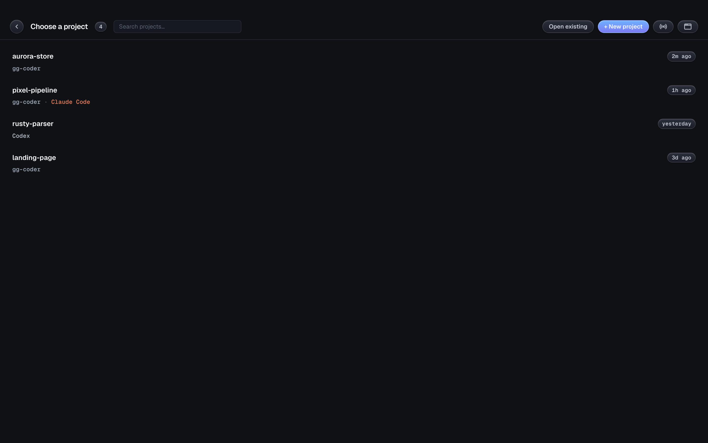

# GG Coder

<p align="center">
  <strong>Cause the other coding agents piss me off.</strong>
</p>

<p align="center">
  <a href="https://github.com/KenKaiii/gg-framework/releases/latest"></a>
  <a href="https://www.npmjs.com/package/@kenkaiiii/ggcoder"></a>
  <a href="LICENSE"></a>
  <a href="https://youtube.com/@kenkaidoesai"></a>
  <a href="https://skool.com/kenkai"></a>
</p>

---

# ⭐ GG Coder, the desktop app

**This is the main thing.** A real desktop app, not a chat box with a code theme. Every
window is its own agent, pointed at its own project folder, running real tools on your
machine.

<p align="center">
  <a href="https://github.com/KenKaiii/gg-framework/releases/latest"></a>
  <a href="https://github.com/KenKaiii/gg-framework/releases/latest"></a>
</p>

Signed and notarized on macOS. It updates itself, so you install it once and forget about it.

<p align="center">
  
</p>

## Why it's different

### One window per project

Open GG Coder on your side project in one window, your client's Next.js app in another, a
Rust thing in a third. Each window runs its own agent, its own folder, its own model, its
own history. Nothing bleeds between them. Tile them 2-up or 4-up and watch three agents
work at the same time.

<p align="center">
  
</p>

It also digs up projects you've already worked on in **Claude Code and Codex**, not just
GG Coder. Pick one, keep going.

### You can actually see what it's doing

Chat stays readable. Tools stream in a pinned panel at the bottom, so you see every file
it touches and every command it runs without your conversation turning into a wall of
JSON. Git branch, uncommitted count, open issues and PRs up top. Context %, thinking
level and both models down bottom.

<p align="center">
  
</p>

### Use whatever model you want

Anthropic, OpenAI/Codex, Gemini, Kimi, GLM, MiniMax, DeepSeek, Xiaomi MiMo, xAI,
OpenRouter. OAuth or API key, your call. Swap models mid-conversation, nobody's stopping
you.

<p align="center">
  
</p>

### Including the ones running on your own machine

Ollama, LM Studio, llama.cpp and vLLM get found automatically on their normal ports. No
config, no flags. Real context windows and capabilities come from the server itself, so a
model that can't call tools gets flagged right here instead of blowing up on your first
prompt.

<p align="center">
  
</p>

### It can see

Drag in a screenshot. Paste a design. Throw a video at it. Video goes straight to the
models that handle it (Gemini 3.x, Kimi K3, MiniMax M3, MiMo-V2.5). For the ones that
don't, the agent gets the file and reaches for ffmpeg itself.

### Autopilot and Ken

Flip Autopilot on and Ken (a mentor agent) reviews the work after each run, then pushes it
back for another pass. A second opinion on your code without having to ask for one.

### Plan mode

Read-only poking around first, a written plan you approve, then it goes. For the stuff you
really don't want it improvising on.

### It catches its own type errors

Every edit gets checked by a real language server. TypeScript ships in the box, zero
setup, so type errors get caught and fixed in the same turn it created them. Python, Go,
Rust and C/C++ kick in if their toolchain is on your PATH.

### MCP, subagents, memory, the works

Paste any `claude mcp add …` line and it just works. Spawn subagents for parallel work.
Project memory, notes, chat export, prompt enhancement, your own slash commands in
`.gg/commands/*.md`.

### It watches your quota

Live usage meter in the title bar. How much of your 5-hour and weekly window you've
burned, and when it resets. No more surprise rate limits.

### And it's a bit stupid, on purpose

XP, ranks and streaks for shipping. Sound. ASCII banners. Webcam gaze focus if you want
your eyeballs to switch windows for you.

## Run it from source

```bash
git clone https://github.com/KenKaiii/gg-framework.git
cd gg-framework
pnpm install
pnpm --filter @kenkaiiii/ggcoder build   # build the sidecar first
cd gg-app && pnpm tauri dev
```

Packaging stuff (bundled Node runtime, single-file sidecar, code signing) is in
[gg-app/DISTRIBUTION.md](gg-app/DISTRIBUTION.md).

---

# ⌨️ The CLI

Same agent, in your terminal. The app is the face, this is the engine.

```bash
npm i -g @kenkaiiii/ggcoder
ggcoder
```

OAuth login so there's no API keys to paste, full terminal UI, tools, MCP, LSP
diagnostics, session resume. → [packages/ggcoder](packages/ggcoder/README.md)

---

# 🧱 The framework underneath

Every layer ships on its own. Take one, take all of them.

| Package                                                                    | What it does                                            | README                                           |
| -------------------------------------------------------------------------- | ------------------------------------------------------- | ------------------------------------------------ |
| [`@kenkaiiii/gg-ai`](https://www.npmjs.com/package/@kenkaiiii/gg-ai)       | One streaming API for every provider up there           | [packages/gg-ai](packages/gg-ai/README.md)       |
| [`@kenkaiiii/gg-agent`](https://www.npmjs.com/package/@kenkaiiii/gg-agent) | Agent loop with multi-turn tool execution               | [packages/gg-agent](packages/gg-agent/README.md) |
| [`@kenkaiiii/gg-core`](https://www.npmjs.com/package/@kenkaiiii/gg-core)   | Shared guts: model registry, OAuth, auth storage, paths | [packages/gg-core](packages/gg-core/README.md)   |
| [`@kenkaiiii/ggcoder`](https://www.npmjs.com/package/@kenkaiiii/ggcoder)   | The CLI, plus the sidecar the desktop app runs          | [packages/ggcoder](packages/ggcoder/README.md)   |
| [`@kenkaiiii/gg-boss`](https://www.npmjs.com/package/@kenkaiiii/gg-boss)   | Drives a bunch of workers across projects from one chat | [packages/gg-boss](packages/gg-boss/README.md)   |

```
@kenkaiiii/gg-ai (standalone)
  └─► @kenkaiiii/gg-agent
        └─► @kenkaiiii/gg-core
              ├─► @kenkaiiii/ggcoder ──► GG Coder desktop app ⭐
              └─► @kenkaiiii/gg-boss
```

The desktop app forks **zero** agent logic. Windows, IPC and UI live in `gg-app/`.
Everything else is the exact same spine the CLI runs.

## What do I actually need?

| You want to...                                      | Use                                                                               |
| --------------------------------------------------- | --------------------------------------------------------------------------------- |
| Code with a real UI, on every project at once       | **[Download GG Coder](https://github.com/KenKaiii/gg-framework/releases/latest)** |
| Code in your terminal                               | `npm i -g @kenkaiiii/ggcoder`                                                     |
| Run a bunch of agents across projects from one chat | `npm i -g @kenkaiiii/gg-boss`                                                     |
| Build your own agent that calls tools and loops     | `npm i @kenkaiiii/gg-agent`                                                       |
| Stream from any LLM provider with one API           | `npm i @kenkaiiii/gg-ai`                                                          |

---

## For devs

```bash
pnpm install
pnpm build      # tsc across all packages
pnpm check      # typecheck
pnpm test       # vitest
```

TypeScript 5.9 · pnpm workspaces · Tauri 2 · React 19 · Vite 7 · Ink 6 · Vitest 4 · Zod v4

---

## Come hang out

- [YouTube @kenkaidoesai](https://youtube.com/@kenkaidoesai) for tutorials and demos
- [Skool community](https://skool.com/kenkai)

---

## License

MIT

---

<p align="center">
  <strong>Less bloat. More coding. Every model. Every project. One window each.</strong>
</p>

<p align="center">
  <a href="https://github.com/KenKaiii/gg-framework/releases/latest"></a>
  <a href="https://www.npmjs.com/package/@kenkaiiii/ggcoder"></a>
</p>
