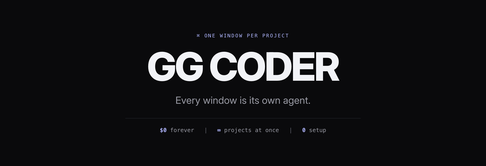
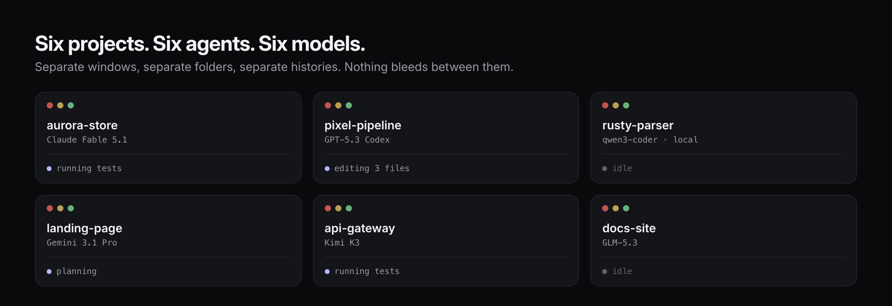
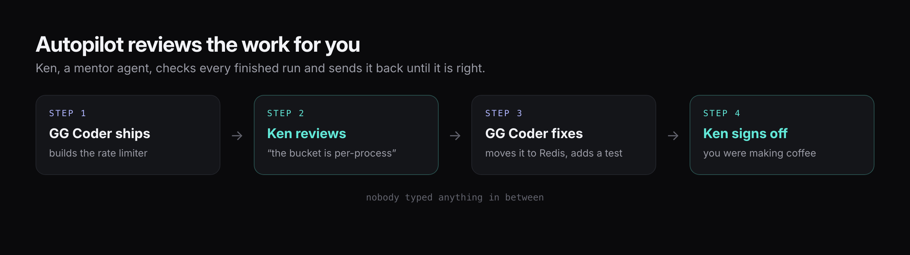

<p align="center">
  
</p>

<p align="center">
  <strong>Cause the other coding agents piss me off.</strong>
</p>

<p align="center">
  <a href="https://github.com/KenKaiii/gg-framework/releases/latest"></a>
  <a href="https://github.com/KenKaiii/gg-framework/stargazers"></a>
  <a href="https://www.npmjs.com/package/@kenkaiiii/ggcoder"></a>
  <a href="LICENSE"></a>
  <a href="https://youtube.com/@kenkaidoesai"></a>
  <a href="https://skool.com/kenkai"></a>
</p>

<p align="center">
  macOS · Windows · <a href="#-get-it">free forever</a> · no subscription, no seat fee, no middleman
</p>

<p align="center">
  <em>Bring the plan you already pay for. Or run it entirely on your own hardware, offline.</em>
</p>

---

## 😤 Why this exists

I built this because every other coding agent and setup pissed me off.

You've got a few things on the go. A side project, a client's app, that thing you keep meaning to finish. Your agent handles **one** of them at a time, so you split a terminal into panes, lose track of which pane is which, and the good one gets buried under the one you stopped caring about. Then the tool wants $20 a month to rent you a plan you already pay for.

So I made the one I wanted: **more power, less faffing about, and every feature nobody else was shipping.**

## 🪟 The fix

**A real desktop app.** Every window is its own agent, its own project folder, its own model, its own history. Nothing bleeds between them.

<p align="center">
  
</p>

Tile 2, 4, 6, or hit auto-arrange and it lays out however many you've got open. Six isn't the ceiling. **That's four features shipping while you review one.**

And it stays light. The shell is **Rust**. No Electron, no bundled browser engine sitting in RAM per window. It uses the renderer your OS already ships, and a window only costs you something while its agent is actually running. Six open is a normal Tuesday, not a fan event.

<p align="center">
  <a href="https://github.com/KenKaiii/gg-framework/releases/latest"></a>
  <a href="https://github.com/KenKaiii/gg-framework/releases/latest"></a>
</p>

Signed and notarized on macOS. It updates itself, so you install it once and forget about it.

---

## 👀 You can see what it's doing

Chat stays readable. Tools stream in a pinned panel at the bottom, so you watch every file it touches and every command it runs without your conversation turning into a wall of JSON.

Git branch, uncommitted count, open issues and PRs up top. Context %, thinking level and both models down bottom.

<p align="center">
  
</p>

## 🤖 Autopilot, the one nobody knows about

Flip it on and **Ken**, a mentor agent, reviews every finished run. Not good enough? He sends GG Coder straight back in with specific feedback, and it keeps going until he signs off. You go make coffee.

<p align="center">
  
</p>

That's a real loop, and nobody typed anything in between. **This is the closest thing to a senior dev reviewing your agent's PRs at 3am.**

## 💉 It builds from code that actually shipped

Your agent learned to code from a snapshot of the internet, and that snapshot is old. So before GG Coder writes anything nontrivial, it reads real, current open-source repos sitting on your own disk, via [Agent Steroids](https://github.com/KenKaiii/agent-steroids). Offline, no rate limits.

One click on the Home screen installs it. Then `/steroids` profiles your project, finds the repos that match it, and indexes the ones you pick. **Your agent stops guessing at APIs that changed last quarter.**

## 🔓 Nothing to subscribe to

**You already pay for a plan. Use it.** Log in the same way you log into anything, and GG Coder runs on the subscription you've got. Twelve providers are built in, every big name and the cheap ones too, so you're never stuck with whoever put their prices up this month.

Some accounts take a plan and a backup key at once: your subscription goes first, and the key quietly covers you the second the plan runs dry. **No dead stop halfway through a build.**

Got something running on your own machine? It's found automatically, and works with no internet at all.

**Swap mid-conversation whenever you like.** Put the expensive one on the hard problem, the cheap one on the grind, and run both at the same time in different windows.

## ✨ Everything else

|                                 |                                                                                                                                                                |
| ------------------------------- | -------------------------------------------------------------------------------------------------------------------------------------------------------------- |
| **It can see**                  | Drag in a screenshot, paste a design, throw a video at it. It watches the video and builds what you showed it                                                  |
| **Plan mode**                   | It looks around and writes you a plan. Nothing gets touched until you say go                                                                                   |
| **Catches its own mistakes**    | Broken code is spotted and fixed in the same breath it was written, before it ever reaches you                                                                 |
| **Knows your CLIs**             | Spots 35 platform tools like `gh`, `vercel` and `railway` in your project and drives them for logs, deploys and env vars instead of sending you to a dashboard |
| **Picks up where you left off** | Finds the projects you've been working on in Claude Code and Codex too, not just GG Coder ones                                                                 |
| **Remembers your project**      | Notes, memory, chat export, and your own shortcut commands. Add any tool you find online by pasting one line                                                   |
| **Watches your usage**          | A live meter up top shows how much of your plan you've burned and exactly when it resets. No surprise cut-offs                                                 |
| **A bit stupid, on purpose**    | XP, ranks and streaks for shipping. Sound. ASCII banners. Webcam gaze focus, if you want your eyeballs to switch windows for you                               |

---

## 🚀 Get it

<p align="center">
  <a href="https://github.com/KenKaiii/gg-framework/releases/latest"></a>
</p>

Prefer the terminal? Same agent, same engine:

```bash
npm i -g @kenkaiiii/ggcoder
ggcoder
```

OAuth login so there are no API keys to paste, full terminal UI, tools, MCP, LSP diagnostics, session resume. → [packages/ggcoder](packages/ggcoder/README.md)

---

## 🧱 The framework underneath

The desktop app forks **zero** agent logic. Windows, IPC and UI live in `gg-app/`; everything else is the exact same spine the CLI runs, and every layer ships on npm on its own.

```
@kenkaiiii/gg-ai (standalone)
  └─► @kenkaiiii/gg-agent
        └─► @kenkaiiii/gg-core
              ├─► @kenkaiiii/ggcoder ──► GG Coder desktop app ⭐
              └─► @kenkaiiii/gg-boss
```

| Package                                                                  | What it does                                              |
| ------------------------------------------------------------------------ | --------------------------------------------------------- |
| [`@kenkaiiii/gg-ai`](packages/gg-ai/README.md)                           | One streaming API for every provider up there             |
| [`@kenkaiiii/gg-agent`](packages/gg-agent/README.md)                     | Agent loop with multi-turn tool execution                 |
| [`@kenkaiiii/gg-core`](https://www.npmjs.com/package/@kenkaiiii/gg-core) | Shared guts: model registry, OAuth, auth storage, paths   |
| [`@kenkaiiii/ggcoder`](packages/ggcoder/README.md)                       | The CLI, plus the sidecar the desktop app runs            |
| [`@kenkaiiii/gg-boss`](packages/gg-boss/README.md)                       | Drives a bunch of workers across projects from one chat   |
| [`@kenkaiiii/gg-voice`](packages/gg-voice/README.md)                     | Realtime voice sessions, bridged into ggcoder and gg-boss |

<details>
<summary><strong>👨‍💻 Run it from source</strong></summary>

```bash
git clone https://github.com/KenKaiii/gg-framework.git
cd gg-framework
pnpm install
pnpm --filter @kenkaiiii/ggcoder build   # build the sidecar first
cd gg-app && pnpm tauri dev
```

```bash
pnpm build      # tsc across all packages (order: gg-ai → gg-agent → ggcoder)
pnpm check      # typecheck
pnpm test       # vitest
pnpm lint
```

TypeScript 5.9 · pnpm workspaces · Tauri 2 · React 19 · Vite 7 · Ink 6 · Vitest 4 · Zod v4

Packaging (bundled Node runtime, single-file sidecar, code signing) is in
[gg-app/DISTRIBUTION.md](gg-app/DISTRIBUTION.md). README art is generated by
`node gg-app/scripts/render-readme-art.mjs`; product shots by
`node gg-app/scripts/capture-screenshots.mjs`.

</details>

---

## 👥 Come hang out

- [YouTube @kenkaidoesai](https://youtube.com/@kenkaidoesai), tutorials and demos
- [Skool community](https://skool.com/kenkai)

MIT licensed. Use it, change it, ship it.

---

<p align="center">
  <strong>Every model. Every project. One window each.</strong>
</p>

<p align="center">
  <a href="https://github.com/KenKaiii/gg-framework/releases/latest"></a>
</p>
