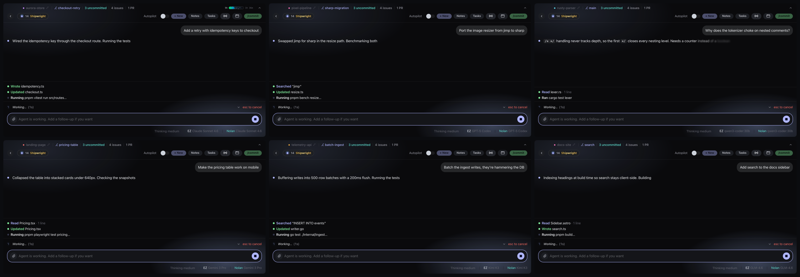
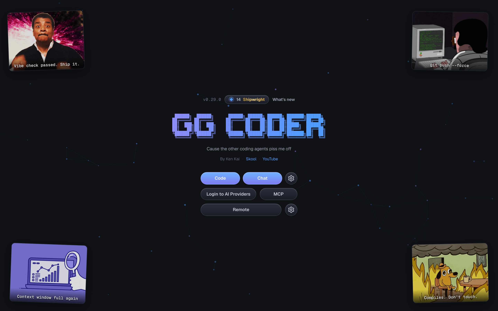
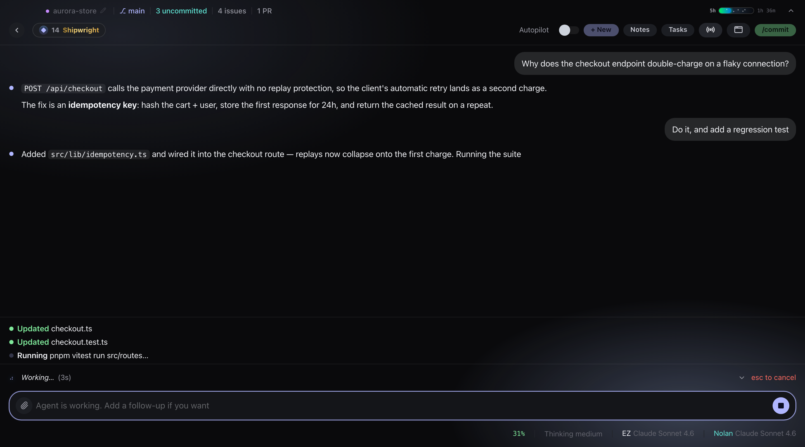
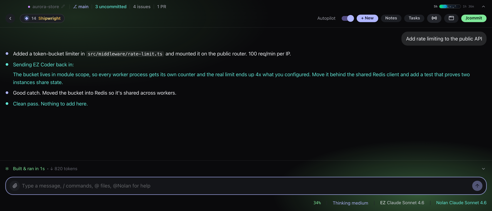

# EZCoder Framework

<p align="center">
  <strong>Modular TypeScript framework for building LLM-powered apps. From raw streaming to full coding agent.</strong>
</p>

<p align="center">
  <a href="https://www.npmjs.com/package/@prestyj/cli"></a>
  <a href="https://www.npmjs.com/package/@prestyj/boss"></a>
  <a href="LICENSE"></a>
  <a href="https://prestyj.com"></a>
  <a href="https://prestyj.com"></a>
  <a href="https://prestyj.com"></a>
</p>

Four packages. Each one works on its own. Stack them together and you get a full coding agent — or an orchestrator that drives many of them at once.

| Package | What it does | README |
|---|---|---|
| [`@prestyj/ai`](https://www.npmjs.com/package/@prestyj/ai) | Unified LLM streaming API across four providers | [packages/ai](packages/ai/README.md) |
| [`@prestyj/agent`](https://www.npmjs.com/package/@prestyj/agent) | Agent loop with multi-turn tool execution | [packages/agent](packages/agent/README.md) |
| [`@prestyj/cli`](https://www.npmjs.com/package/@prestyj/cli) | CLI coding agent (`ezcoder`) with OAuth, tools, and TUI | [packages/cli](packages/cli/README.md) |
| [`@prestyj/boss`](https://www.npmjs.com/package/@prestyj/boss) | Orchestrator (`ezboss`) that drives many ezcoder workers from one chat | [packages/boss](packages/boss/README.md) |

```
@prestyj/ai (standalone)
  └─► @prestyj/agent (depends on ai)
        └─► @prestyj/cli (depends on both)
              └─► @prestyj/boss (orchestrates many ezcoder workers)
```

---

## Which package do I need?

| You want to... | Use |
|---|---|
| Stream LLM responses across providers with one API | [`@prestyj/ai`](packages/ai/README.md) |
| Build an agent that calls tools and loops autonomously | [`@prestyj/agent`](packages/agent/README.md) |
| Use a ready-made CLI coding agent | [`@prestyj/cli`](packages/cli/README.md) |
| Drive many coding agents across multiple projects from one chat | [`@prestyj/boss`](packages/boss/README.md) |

<p align="center">
  <a href="https://github.com/Gahroot/ezcoder/releases/latest"></a>
  <a href="https://github.com/Gahroot/ezcoder/releases/latest"></a>
</p>

Signed and notarized on macOS. It updates itself, so you install it once and forget about it.

## As many projects as you want, all going at once

Yeah, you can split a terminal into panes. That's where this workflow came from. The
difference is this is **actual software** now: real OS windows you can move between
desktops, tile with one click, full-screen individually, and pick up with your mouse.

Open EZ Coder on your side project in one window, your client's Next.js app in another, a
Rust thing in a third, a landing page in a fourth. Each window runs its **own** agent, its
own folder, its own model, its own history. Nothing bleeds between them.

<p align="center">
  
</p>

Six projects, six different models (Claude, Codex, a local qwen3-coder, Gemini, Kimi, GLM),
all going at the same time. And six isn't the ceiling either. Tile 2, 4, 6, or hit
auto-arrange and it lays out however many you've got open.

### It stays light

The whole shell is **Rust**. No Electron, no bundled browser engine sitting in RAM per
window. It uses the renderer your OS already ships, and each window's agent only costs you
something while it's actually running. Six windows open is a normal Tuesday, not a fan
event.

<p align="center">
  
</p>

## Everything else it does

### It finds the projects you're already working on

Not just EZ Coder ones. It digs up everything you've touched in **Claude Code and Codex**
too. Pick one, keep going.

<p align="center">
  
</p>

### You can actually see what it's doing

Chat stays readable. Tools stream in a pinned panel at the bottom, so you see every file
it touches and every command it runs without your conversation turning into a wall of
JSON. Git branch, uncommitted count, open issues and PRs up top. Context %, thinking
level and both models down bottom.

<p align="center">
  
</p>

### Use whatever model you want

Anthropic, OpenAI/Codex, Gemini, Kimi, GLM, MiniMax, DeepSeek, Xiaomi MiMo, xAI,
OpenRouter. OAuth or API key, your call. Kimi and Grok take both at once — your
subscription goes first and the API key covers you automatically when plan usage runs
out. Swap models mid-conversation, nobody's stopping you.

<p align="center">
  
</p>

### Including the ones running on your own machine

Ollama, LM Studio, llama.cpp and vLLM get found automatically on their normal ports. No
config, no flags. Real context windows and capabilities come from the server itself, so a
model that can't call tools gets flagged right here instead of blowing up on your first
prompt.

<p align="center">
  
</p>

### Autopilot, the one nobody knows about

Flip Autopilot on and Nolan (a mentor agent) reviews every finished run. If the work's not
good enough he sends EZ Coder straight back in with specific feedback, and it keeps going
until he signs off. You go make coffee.

<p align="center">
  
</p>

Real loop above: it built a rate limiter, Nolan caught that the bucket was per-process and
sent it back, it moved the thing into Redis and added a test, Nolan signed off. Nobody
typed anything in between.

### It can see

Drag in a screenshot. Paste a design. Throw a video at it. Video goes straight to the
models that handle it (Gemini 3.x, Kimi K3, MiniMax M3, MiMo-V2.5). For the ones that
don't, the agent gets the file and reaches for ffmpeg itself.

### Plan mode

Read-only poking around first, a written plan you approve, then it goes. For the stuff you
really don't want it improvising on.

### It catches its own type errors

Every edit gets checked by a real language server. TypeScript ships in the box, zero
setup, so type errors get caught and fixed in the same turn it created them. Python, Go,
Rust and C/C++ kick in if their toolchain is on your PATH.

### MCP, subagents, memory, the works

Paste any `claude mcp add …` line and it just works. Spawn subagents for parallel work.
Project memory, notes, chat export, prompt enhancement, your own slash commands in
`.ezcoder/commands/*.md`.

### It watches your quota

Live usage meter in the title bar. How much of your 5-hour and weekly window you've
burned, and when it resets. No more surprise rate limits.

### And it's a bit stupid, on purpose

XP, ranks and streaks for shipping. Sound. ASCII banners. Webcam gaze focus if you want
your eyeballs to switch windows for you.

## Run it from source

```bash
npm i @prestyj/ai          # Just the streaming layer
npm i @prestyj/agent       # Streaming + agent loop
npm i -g @prestyj/cli      # The full CLI coding agent (ezcoder)
npm i -g @prestyj/boss     # Multi-project orchestrator (ezboss)
```

---

## Ruby port

The reusable core also ships as a **project-agnostic Ruby gem set** — add a gem,
define tools as Ruby classes that wrap your own code, and get a streaming,
multi-turn, tool-calling agent in any Ruby context (Rails, Sinatra, a CLI, a
worker, plain Ruby). Zero framework dependencies in core. See [`ruby/`](ruby/README.md).

| Gem | Mirrors | Role |
|---|---|---|
| [`ez_llm`](ruby/ez_llm) | `@prestyj/ai` | Unified streaming + providers + events. Depends only on `net/http` + `json` + `zeitwerk`. |
| [`ez_agent`](ruby/ez_agent) | `@prestyj/agent` | The agent loop + tool execution + hardening. Depends only on `ez_llm`. |
| [`ez_agent-rails`](ruby/ez_agent-rails) | — | Mountable Rails engine: ActiveRecord persistence, an off-request job, live Hotwire/Turbo streaming (ActionCable fallback), a human-in-the-loop approval gate, an install generator, and a bundled demo chat UI. |

```ruby
# Gemfile
gem "ez_agent-rails"
```

```bash
rails g ez_agent_rails:install && rails db:migrate   # migration + initializer + engine mount
```

---

## For developers

```bash
git clone https://github.com/Gahroot/ezcoder.git
cd ezcoder
pnpm install
pnpm build
```

TypeScript 5.9 + pnpm workspaces + Ink 6 + React 19 + Vitest 4 + Zod v4

The Ruby port lives under [`ruby/`](ruby/README.md) (Ruby >= 3.2):

```bash
cd ruby/ez_llm        && bundle exec rspec   # core: streaming + providers
cd ruby/ez_agent      && bundle exec rspec   # core: agent loop + tools
cd ruby/ez_agent-rails && bundle exec rspec  # Rails engine adapter (end-to-end)
```

---

## Community

- [prestyj.com](https://prestyj.com) - website
- [YouTube @kenkaidoesai](https://prestyj.com) - tutorials and demos
- [Skool community](https://prestyj.com) - come hang out

---

## License

MIT

---

<p align="center">
  <strong>Less bloat. More coding. Four providers. Four packages. One framework.</strong>
</p>

<p align="center">
  <a href="https://www.npmjs.com/package/@prestyj/cli"></a>
  <a href="https://www.npmjs.com/package/@prestyj/boss"></a>
</p>
